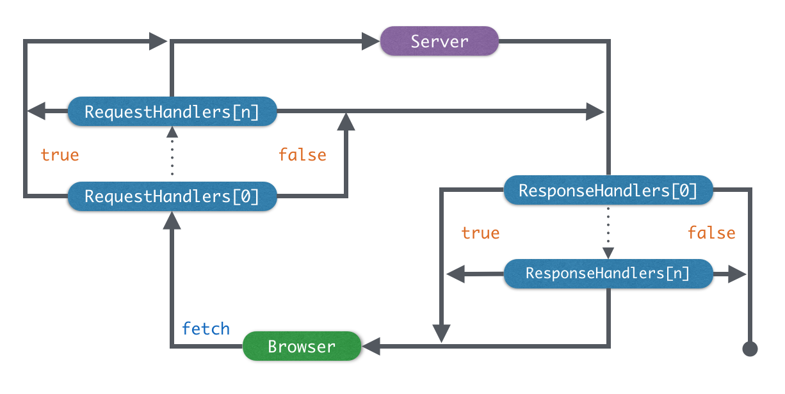

# FCeptor Project

A fetch interceptor

### Install

```bash
npm install fceptor
```

### Usage

```javascript
FCeptor.when(method, route, requestHandler, responseHandler);

FCeptor[method](route, requestHandler, responseHandler);
```

### Demo

###### 1. Fake a resource

```html
<script src="/node_modules/fceptor/fceptor.js"></script>
<script>
FCeptor.get(new RegExp('/hello$'), ctx => {
  ctx.response = new Response('Hello FCeptor');
  return false;
});

fetch('/hello').then(response => {
  return response.text();
}).then(result => {
  result === 'Hello FCeptor';
});
</script>
```

###### 2. Go to login while any 401 code responsed

```html
<script src="/node_modules/fceptor/fceptor.js"></script>
<script>
FCeptor.when(/^/, new RegExp('^/login$'), null, ctx => { 
  if(ctx.response.status !== 401) return;
  location.href = '/login';
});
</script>
```

### Chematic Diagram


