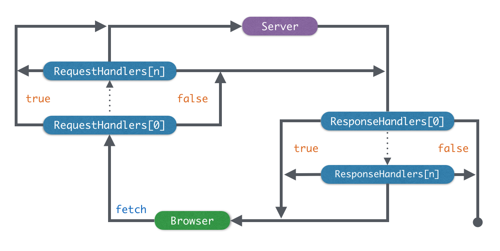

## FCeptor

A fetch interceptor

## Install

```bash
npm install fceptor
```

## Usage

```javascript
FCeptor.when(method, route, requestHandler, responseHandler);
```

| name            | type             | meaning               |
| --------------- | ---------------- | --------------------- |
| method          | RegExp or String | HTTP Method Matcher   |
| route           | RegExp or String | Request Path Matcher  |
| requestHandler  | Function         | Request Hook Handler  |
| responseHandler | Function         | Response Hook Handler |

In addition, some shortcut methods are provided:

```javascript
FCeptor.get(route, requestHandler, responseHandler);
FCeptor.post(route, requestHandler, responseHandler);
FCeptor.put(route, requestHandler, responseHandler);
FCeptor.delete(route, requestHandler, responseHandler);
FCeptor.patch(route, requestHandler, responseHandler);
```

## Schematic Diagram



## Demo

### 1. Fake a resource

```html
<script src="/node_modules/fceptor/fceptor.js"></script>
<script>
FCeptor.get(new RegExp('/hello$'), ctx => {
  ctx.response = new Response('Hello FCeptor');
  return false;
});

fetch('/hello').then(response => {
  return response.text();
}).then(result => {
  result === 'Hello FCeptor';
});
</script>
```

### 2. Go to login on 401

```html
<script src="/node_modules/fceptor/fceptor.js"></script>
<script>
FCeptor.when(/^/, new RegExp('^/login$'), null, ctx => { 
  if(ctx.response.status !== 401) return;
  location.href = '/login';
});
</script>
```
